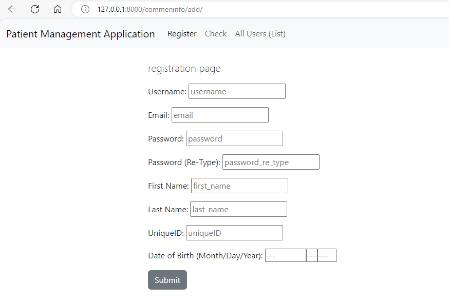
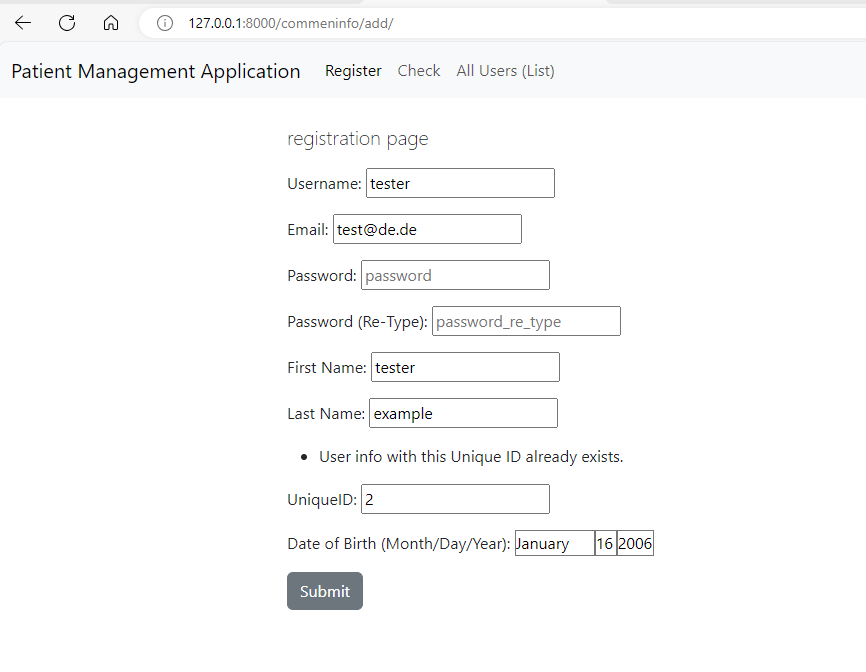

## Python Training Certification Course

### Patient Management Application
### Description

Many patients visit AB Hospital for a routine health checkup, accidental injuries or any other ailment treatment. Each patient has to register with the hospital if they are visiting the hospital for the first time. So, it gets very difficult for the reception boy Suresh to manage the records of every patient in a logbook manually as if the user has already registered he has to search the patient’s name throughout the book containing thousands of records.

Objective: To develop an application in Django that checks if the patient is already registered and registers the patient if they’re not.

Domain:  Customer Support

Steps to perform:            

Tasks -

Do the following to execute your application

```shell
    python manage.py migrate
```
  
You can view the Live preview of your application by appending /commoninfo in the Live preview URL i.e “<LivePreviewURL>/commoninfo”.


You can visit the registration page by click the button "Register" or appending /add to the live preview URL i.e. “<LivePreviewURL>/commoninfo/add”.


 
You can visit the page to check if patient is registered on the button "check", on top in the navbar or by appending /fetch to the live preview URL i.e. “<LivePreviewURL>/commoninfo/fetch”.
 


The UserInfo will be store in a sqlite database (models.py) with all the import fields username, password, uniqueID and date of birth. To add the user will be validate the fields e.g. username and uniqueID cannot be empty and must be unique, password cannot be empty and must be equal to password (re-type) 

Invalid password


Invalied uniqueID


Registration was successful


Consists of a textbox to enter uniqueID after clicking on SUBMIT it should show patient’s username, uniqueID and date of birth.

uniqueID are not exist


show patient info


In addition, all users can be queried via the navbar menu "All Users (List)"


